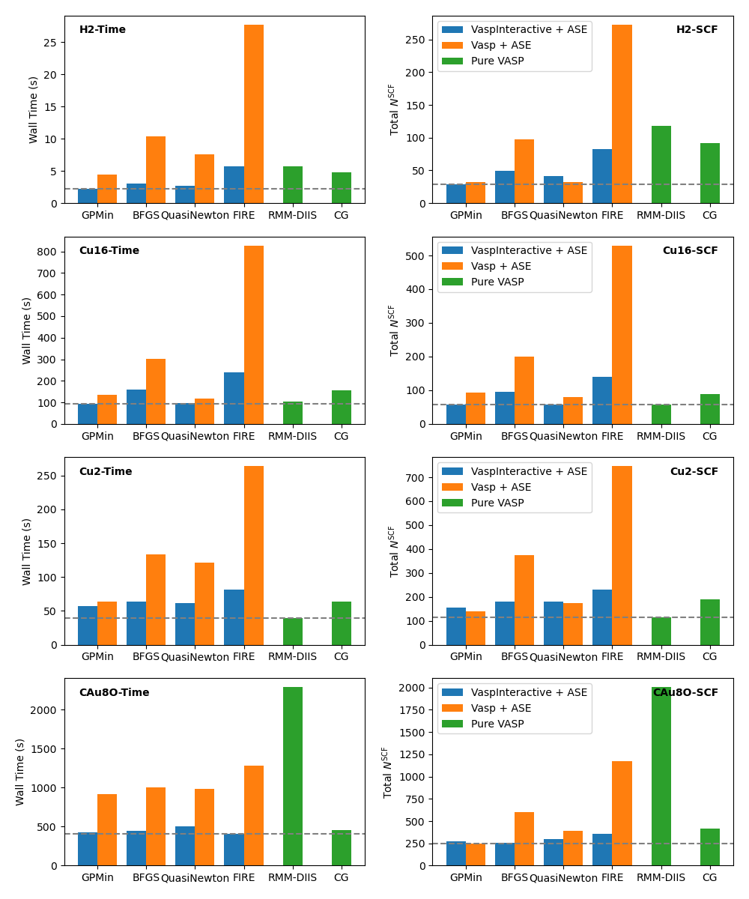
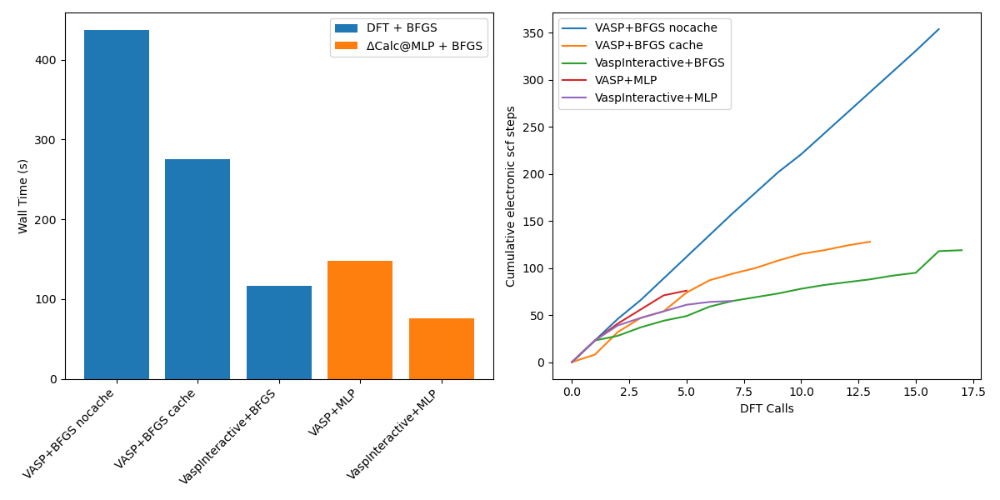

# Interactive Vasp calculator
This repo provides a patched version of the `VaspInteractive` calculator, 
originally from Atomic Simulation Environment (`ase`).

Improvement from original `VaspInteractive` include:
- Accepting same constructor as normal `Vasp` calculator.
- Better process management to avoid orphan process when exiting.
- A context mode to run the `VaspInteractive` for improved garbage collection.
- Parsing OUTCAR for ionic step results instead of vasprun.xml which can be corrupted

## How does it work?
`VaspInteractive` invokes the interactive VASP mode by setting the keyword `INTERACTIVE = .TRUE.` in INCAR file.
This option is equivalent to `IBRION = 11` (although no force information printed to `stdout`).

In the interactive mode, after reading the initial input files (INCAR, POTCAR, POSCAR, KPOINTS), 
VASP pauses at the end of the first ionic step
and asks for the positions of the next ionic step. 
Once user types in the **scaled coordinates**, 
VASP performs the next ionic step using previous density and wavefunction. 

The ionic cycles of interactive mode VASP can be terminated by any of the following:

1) setting `NSW` values
2) writing STOPCAR file to the calculation directory
3) invalid inputs to stdin (such as `Ctrl+C`)

`VaspInteractive` uses method 2) to stop the ionic cycles. In general, `VaspInteractive` can save up to 50% of the wall 
time compared with classic `Vasp` calculator (combined with ASE optimizers such as BFGS), since less electronic steps are
required and program spin-up time is drastically reduced.

**NOTE**: currently the code only works with VASP version >= 6. In principle older version of VASP can be compatible but user
needs to make custom patches to `main.F` in VASP source code to disable chunked output.

## How to use
Only dependency is `ase`. Hopefully in the near future the `VaspInteractive` calculator will be merged with ASE upstream.

- Install via `pip`

    ```sh
        pip install git+https://github.com/ulissigroup/vasp-interactive.git
    ```
    
- Minimal example
    
    The following code shows how to run an BFGS-optimization of H2 molecule using `VaspInteractive`:
    
    ```python
    from ase.optimize import BFGS
    from ase.build import molecule
    from vasp_interactive import VaspInteractive
    atoms = molecule("H2", vacuum=4, pbc=True)
    with VaspInteractive(xc="pbe") as calc:
        atoms.calc = calc
        dyn = BFGS(atoms)
        dyn.run(fmax=0.05)
    ```
    
    The only difference using `VaspInteractive` compared with pure VASP+BFGS, 
    is that `VaspInteractive` is wrapped inside a context manager. The `with` statemen is 
    the recommended way to run `VaspInteractive` as it can seamlessly stop the VASP process
    associated with the calculator outside the context. 
    
- Context mode vs classic mode

    You can also use `VaspInteractive` the classic way. However you must manually stop the calculator by calling
    `calc.finalize()`, otherwise there might be orphan VASP processes running in the background.
    
    The same code of structural relaxation for H2, but in the classic mode:
    ```python
    from ase.optimize import BFGS
    from ase.build import molecule
    from vasp_interactive import VaspInteractive
    atoms = molecule("H2", vacuum=4, pbc=True)
    calc = VaspInteractive(xc="pbe"):
    atoms.calc = calc
    dyn = BFGS(atoms)
    dyn.run(fmax=0.05)
    # Finalize the calculator and stop VASP process
    calc.finalize()
    assert calc.process is None
    ```

    Note: if your code raises exceptions when `VaspInteractive` is running, it is not always guaranteed that 
    the VASP process is terminated by standard Python garbage collection. Test your own code. This issue is 
    solved when running `VaspInteractive` in context mode.

## Benchmark

The following figure shows the benchmark of `VaspInteractive` vs classic `Vasp`. The structures for relaxation are taken from the 
GPAW [optimizer benchmark](https://wiki.fysik.dtu.dk/gpaw/devel/ase_optimize/ase_optimize.html) and BFGS is used as the optimizer in all cases.
All calculations are done using AMD Ryzen Threadripper 3990X (8 MPI ranks, 4105.948 GHz).

Two quantities are compared:
1) Wall time (right panel).
2) Total electronic scf steps (i.e. sum of scf steps per ionic cycle) (left panel).

Performance of relaxation using pure VASP routines (`IBRION=2`, conjugate gradient) is used as the reference. 
`VaspInteractive` reduces the wall time and electronic steps compared with the classic VASP+BFGS appraoch.


Below are the details about the ionic and electronic steps (using system CAu8O):


In the case of CO+Au(111) slab system, `VaspInteractive` seems even to be better
than the VASP CG optimizer. Note such results can be tuned by parameters such as IBRION or IWAVEPR.

A more detailed example comparing the wall time and SCF cycles for `VaspInteractive` and classic `Vasp` combined with 
various ASE-optimizers can be find in the following figure. The horizontal broken lines are the lowest value among all optimizers
for the same structure.



In addition to the constant time reduction using `VaspInteractive+ASE` compared with `Vasp+ASE`, 
`GPMin` seems to be the most reliable optimizer to be combined. In most cases `VaspInteractive+GPMin` 
outperforms VASP internal CG routine (`IBRION=2`) and gives more consistent results than RMM-DIIS (`IBRION=1`).

`VaspInteractive` is also possible to combine with some more complex optimizers like `al_mlp+amptorch`, 
as the following benchmark for a 7-atom Cu cluster shows, comparing with single point VASP calculators, 
`VaspInteractive` is capable of reducing the electronic scf steps by up to 90%.




## More examples
- [examples/ex01_h2_relax.py](examples/ex01_h2_relax.py): Basic example of structural relaxation
- [examples/ex02_h2_comparison.py](examples/ex02_h2_comparison.py): Comparing `VaspInteractive` with pure VASP and VASP+BFGS
- [examples/ex03_exception.py](examples/ex03_exception.py): Example of error handling and garbage collection
- [examples/ex04_reset_calculator.py](examples/ex04_reset_calculator.py): Restarting `VaspInteractive` for various structures (different formulae)
- [examples/ex05_rattle_atoms.py](examples/ex05_rattle_atoms.py): Apply `VaspInteractive` to sequence of structures (same formula, different positions)
- [examples/ex06_benchmark.py](examples/ex06_benchmark.py) and [examples/ex07_benchmark.py](examples/ex07_benchmark.py): Running benchmark. You can delete `examples/benchmark.pkl` and `examples/benchmark-large.pkl` if you want to re-run the calculations (may take up to a few hours).
- [examples/ex08_dask_par.py](examples/ex08_dask_par.py): Simple example running parallel relaxation jobs using Dask. See `examples/ex08_sample_output.txt` for an example of output.
- [examples/ex10_mlp_online.py](examples/ex10_mlp_online.py): Example with online machine learning potential (`al_mlp` + `amptorch`).


## Limitations
- Currently does not support change of unit cell from stdin. EOS calculations should be performed separatedly.
- STOPCAR creates 1 more extra ionic step (1 electronic step as well) before calculation stops. 
- For some systems the reduction of electronic scf steps during relaxation is not as much as pure VASP routines.

## TODO
- [ ] Check compatibility with `Fireworks` and `Dask`
- [ ] Correctly handle parallel (MPI) calls to `VaspInteractive`
- [x] Implement the `restart` keyword as normal `Vasp` calculator
- [x] Test compatibility with `copy` and `deepcopy`
- [ ] Test compatibility with other optimizers

    
    
