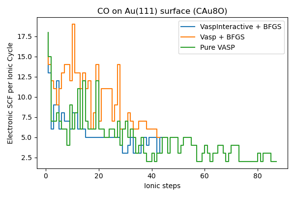
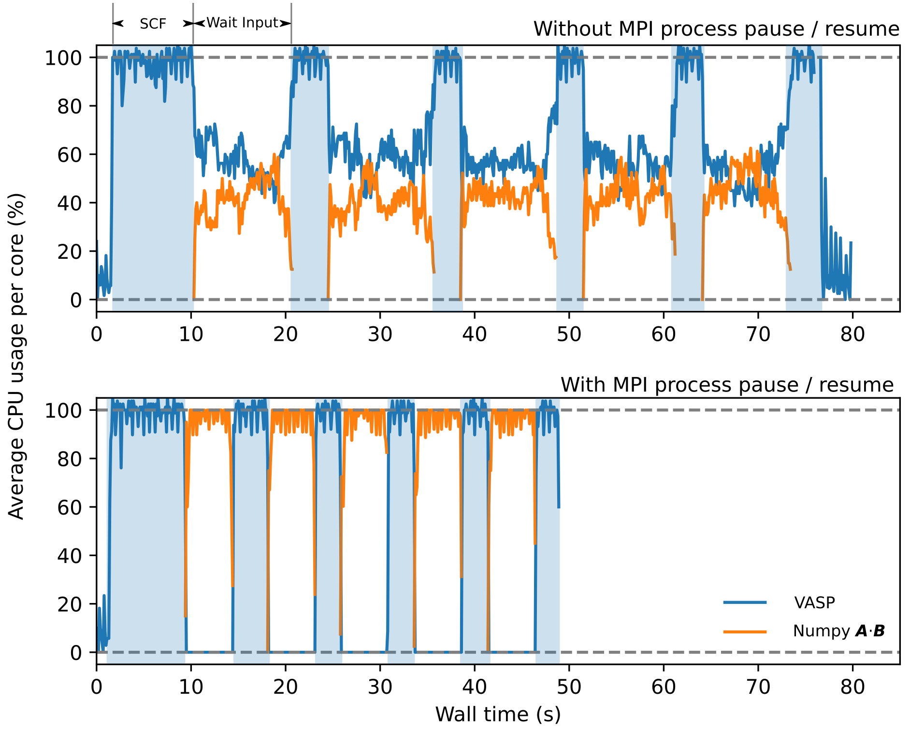

# `VaspInteractive`: a stream-based calculator for VASP


## TL;DR

`VaspInteractive` is a faster yet fully-compatible replacement for the original `Vasp` calculator from the 
[Atomic Simulation Environment (`ase`)](https://databases.fysik.dtu.dk/ase/ase/calculators/vasp.html) 
by leveraging the interactive mode of Vienna Ab Initio Package (VASP). Up to 75% reduction of DFT electronic self-consistent 
cycle compared with the original `Vasp` implementation can be achieved (see [Benchmark](#benchmark) section).

### Installation

```bash
pip install git+https://github.com/ulissigroup/vasp-interactive.git
```

After [setting proper environmental variables](https://databases.fysik.dtu.dk/ase/ase/calculators/vasp.html#environment-variables),
download the script and run the compatibility test with your local VASP setup:

```bash
wget https://raw.githubusercontent.com/ulissigroup/vasp-interactive/main/examples/ex00_vasp_test.py
python ex00_vasp_test.py
```

If the compatibility test fails, your VASP build may truncate output. See the **Troubleshooting** section for more details.


### Basic usage

Existing code written with ase's `Vasp` calculator can be easily replaced by `VaspInteractive`, 
the following example shows how to run a structural optimization using `VaspInteractive` with an BFGS optimizer:
```python
from ase.optimize import BFGS
from vasp_interactive import VaspInteractive
# atoms: an ase.atoms.Atoms object
# parameters: parameters compatible with ase.calculators.vasp.Vasp
atoms.calc = VaspInteractive(**parameters)
dyn = BFGS(atoms)
dyn.run()
# Special to `VaspInteractive`: close the stream manually
calc.finalize()
```

#### (Recommended) `VaspInteractive` in context-mode

To prevent orphan VASP process running in the background if `calc.finalized()` is not properly added,
we recommend using `VaspInteractive` within a context manager (i.e. using the `with`-clause):
```python
from ase.optimize import BFGS
from vasp_interactive import VaspInteractive
# Exiting the with-clause kills the background VASP process
with VaspInteractive(**parameters) as calc:
    atoms.calc = calc
    dyn = BFGS(atoms)
    dyn.run()
```


## Additional notes
This repo provides a patched version of the `VaspInteractive` calculator, 
originally from Atomic Simulation Environment (`ase`).

Improvement from original `VaspInteractive` include:
- Accepting same constructor as normal `Vasp` calculator.
- Better process management to avoid orphan process when exiting.
- A context mode to run the `VaspInteractive` for improved garbage collection.
- Parsing OUTCAR for ionic step results instead of vasprun.xml which can be corrupted

## How does it work?
`VaspInteractive` invokes the interactive VASP mode by setting the keyword `INTERACTIVE = .TRUE.` in INCAR file.
This option is equivalent to `IBRION = 11` (although no force information printed to `stdout`).

In the interactive mode, after reading the initial input files (INCAR, POTCAR, POSCAR, KPOINTS), 
VASP pauses at the end of the first ionic step
and asks for the positions of the next ionic step. 
Once user types in the **scaled coordinates**, 
VASP performs the next ionic step using previous density and wavefunction. 

The ionic cycles of interactive mode VASP can be terminated by any of the following:

1) setting `NSW` values
2) writing STOPCAR file to the calculation directory
3) invalid inputs to stdin (such as `Ctrl+C`)

`VaspInteractive` uses method 2) to stop the ionic cycles. In general, `VaspInteractive` can save up to 50% of the wall 
time compared with classic `Vasp` calculator (combined with ASE optimizers such as BFGS), since less electronic steps are
required and program spin-up time is drastically reduced. 
<!-- When combined with active learning frameworks like [Finetuna](https://github.com/ulissigroup/finetuna) it can speed up DFT relaxation up to 1 order of magnitude. -->

**NOTE: some builds of VASP 5.x may be incompatible wih `VaspInteractive`.**

See this [issue](https://github.com/ulissigroup/vasp-interactive/issues/6.) for details. 
We have seen some builds of VASP 5.x incompatible with `VaspInteractive` due to broken output files.  Switching to VASP version > 6 (if available) or
recompile your VASP binaries may help. 

**Minimal VASP 5.x support**: starting from version 0.0.9, `VaspInteractive` supports VASP 5.x by parsing the raw output (e.g. `vasp.out` file) in case of broken `OUTCAR` / `vasprun.xml` files, although there are several limitations:
1. Only energy and forces can be get from the calculator
2. `VaspInteractive` must not have the `txt` option set to (`"-"` or `None`)

## How to use
Only dependency is `ase`. Hopefully in the near future the `VaspInteractive` calculator will be merged with ASE upstream.

- Install via `pip`

    ```sh
        pip install git+https://github.com/ulissigroup/vasp-interactive.git
    ```
    
- Minimal example
    
    The following code shows how to run an BFGS-optimization of H2 molecule using `VaspInteractive`:
    
    ```python
    from ase.optimize import BFGS
    from ase.build import molecule
    from vasp_interactive import VaspInteractive
    atoms = molecule("H2", vacuum=4, pbc=True)
    with VaspInteractive(xc="pbe") as calc:
        atoms.calc = calc
        dyn = BFGS(atoms)
        dyn.run(fmax=0.05)
    ```
    
    The only difference using `VaspInteractive` compared with pure VASP+BFGS, 
    is that `VaspInteractive` is wrapped inside a context manager. The `with` statemen is 
    the recommended way to run `VaspInteractive` as it can seamlessly stop the VASP process
    associated with the calculator outside the context. 
    
- Context mode vs classic mode

    You can also use `VaspInteractive` the classic way. However you must manually stop the calculator by calling
    `calc.finalize()`, otherwise there might be orphan VASP processes running in the background.
    
    The same code of structural relaxation for H2, but in the classic mode:
    ```python
    from ase.optimize import BFGS
    from ase.build import molecule
    from vasp_interactive import VaspInteractive
    atoms = molecule("H2", vacuum=4, pbc=True)
    calc = VaspInteractive(xc="pbe"):
    atoms.calc = calc
    dyn = BFGS(atoms)
    dyn.run(fmax=0.05)
    # Finalize the calculator and stop VASP process
    calc.finalize()
    assert calc.process is None
    ```

    Note: if your code raises exceptions when `VaspInteractive` is running, it is not always guaranteed that 
    the VASP process is terminated by standard Python garbage collection. Test your own code. This issue is 
    solved when running `VaspInteractive` in context mode.
### Note:
For `VaspInteractive` to work properly, the VASP executable (i.e. environment variable `$ASE_VASP_COMMAND` or `$VASP_COMMAND`) must not
filter or redirect the stdout from `vasp_std`. If you want to set the file name for capturing the stdout, add `txt=<your-custom-stdout-file>` to the 
initial parameters of `VaspInteractive`.

## Benchmark

The following figure shows the benchmark of `VaspInteractive` vs classic `Vasp`. The structures for relaxation are taken from the 
GPAW [optimizer benchmark](https://wiki.fysik.dtu.dk/gpaw/devel/ase_optimize/ase_optimize.html) and BFGS is used as the optimizer in all cases.
All calculations are done using AMD Ryzen Threadripper 3990X (8 MPI ranks, 4105.948 GHz).

Two quantities are compared:
1) Wall time (right panel).
2) Total electronic scf steps (i.e. sum of scf steps per ionic cycle) (left panel).

Performance of relaxation using pure VASP routines (`IBRION=2`, conjugate gradient) is used as the reference. 
`VaspInteractive` reduces the wall time and electronic steps compared with the classic VASP+BFGS appraoch.


Below are the details about the ionic and electronic steps (using system CAu8O):



In the case of CO+Au(111) slab system, `VaspInteractive` seems even to be better
than the VASP CG optimizer. Note such results can be tuned by parameters such as IBRION or IWAVEPR.

A more detailed example comparing the wall time and SCF cycles for `VaspInteractive` and classic `Vasp` combined with 
various ASE-optimizers can be find in the following figure. The horizontal broken lines are the lowest value among all optimizers
for the same structure.


In addition to the constant time reduction using `VaspInteractive+ASE` compared with `Vasp+ASE`, 
`GPMin` seems to be the most reliable optimizer to be combined. In most cases `VaspInteractive+GPMin` 
outperforms VASP internal CG routine (`IBRION=2`) and gives more consistent results than RMM-DIIS (`IBRION=1`).

`VaspInteractive` is also possible to combine with some more complex optimizers like `al_mlp` 
(with `flare` as underlying machine learnin potential). Online learning optimizer in combination with `VaspInteractive`
can greatly save computation time as compared with direct DFT + BFGS approaches,
as shown in the following benchmark for a 7-atom Cu cluster.


[*Experimental*] A special mode `KubeVaspInteractive` makes the interactive vasp process running inside an 
isolated container on kubernetes pod, with full functioning message communication between the local and remote
processes. This mode can be quite useful when running an ensemble of relaxations with synchronization between
individual steps, and required total CPU numbers are high.

One example is to use `KubeVaspInteractive` to boost Nudged Elastic Bands (NEB) calculations, please see
[examples/ex12_k8s_neb.py](examples/ex12_k8s_neb.py) for more details. 
3-image NEB relaxation for Au diffusion on 2x2x3-Al(001) surface is chosen for benchmark with the following walltime (all calculators use 8X MPI ranks for VASP)
- Sequential VASP: 382.52 s
- Sequential `VaspInteractive` (shared calculator): 532.89 s
- Parallel `KubeVaspInteractive` (3 workers): 49.91 s

Note in this case, sharing `VaspInteractive` on all NEB images is 
not beneficial due to big difference of wavefunctions on neighboring images. 
On the other hand, `KubeVaspInteractive` has nearly linear scaling with worker pod numbers,
if the workload per pod is balanced (see [examples/ex11_k8s_minimal.py](examples/ex11_k8s_minimal.py)).

By default, the MPI processes that run the VASP calculations will occupy 100% cpu on the allocated cores / slots, even when waiting for the inputs. 
This can lead to undesired effects when other CPU-expensive codes are running between two `VaspInteractive` ionic steps. 
Starting from version `0.0.5` we add the `pause_calc` and `resume_calc` methods to `VaspInteractive`, so the user can temporarily free the resources occupied by VASP processes between two ionic steps. 
An example can be found in [ex13_pause_mpi.py](examples/ex13_pause_mpi.py), where computationally expensive operations (e.g. `Numpy` huge matrix multiplication **A·B**) occur between VASP ionic steps. 
The figures below show the CPU usage of VASP and Numpy processes without intervention (upper panel) and with MPI pause / resume (lower panel). With the pause / resume functionality, the `Numpy` threads can gain almost 100% CPU, saving the total computational time.
 


Note currently the functionality is only tested for OpenMPI > 1.3.0. You may need to explicitly add the flag `--mca orte_forward_job_control 1` to your vasp command, or setting via environmental variable `export OMPI_MCA_orte_forward_job_control=1`. 


## More examples
- [examples/ex01_h2_relax.py](examples/ex01_h2_relax.py): Basic example of structural relaxation
- [examples/ex02_h2_comparison.py](examples/ex02_h2_comparison.py): Comparing `VaspInteractive` with pure VASP and VASP+BFGS
- [examples/ex03_exception.py](examples/ex03_exception.py): Example of error handling and garbage collection
- [examples/ex04_reset_calculator.py](examples/ex04_reset_calculator.py): Restarting `VaspInteractive` for various structures (different formulae)
- [examples/ex05_rattle_atoms.py](examples/ex05_rattle_atoms.py): Apply `VaspInteractive` to sequence of structures (same formula, different positions)
- [examples/ex06_benchmark.py](examples/ex06_benchmark.py) and [examples/ex07_benchmark.py](examples/ex07_benchmark.py): Running benchmark. You can delete `examples/benchmark.pkl` and `examples/benchmark-large.pkl` if you want to re-run the calculations (may take up to a few hours).
- [examples/ex08_dask_par.py](examples/ex08_dask_par.py): Simple example running parallel relaxation jobs using Dask. See `examples/ex08_sample_output.txt` for an example of output.
- [examples/ex10_mlp_online.py](examples/ex10_mlp_online.py): Example with online machine learning potential (`al_mlp` + `amptorch`).


## Limitations
- Currently does not support change of unit cell from stdin. EOS calculations should be performed separatedly.
- STOPCAR creates 1 more extra ionic step (1 electronic step as well) before calculation stops. 
- For some systems the reduction of electronic scf steps during relaxation is not as much as pure VASP routines.


    
    
